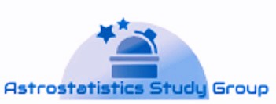

***

The Astrostatistics Study Group (ASG) initiative was born during a pilot mentorship program of [R-Ladies Chicago](https://www.meetup.com/rladies-chicago/) conducted by [Kaelen L. Medeiros](https://twitter.com/kaelen_medeiros) (mentor) and [Caroline K. Williams](https://twitter.com/ckwill36) (mentee) which was started on January 4th, 2018.  

Caroline was exposed to Astrostatistics while looking for the data she wants to work with. She is interested in analyzing Exoplanets data that are abundantly available for public. 

Astrostatistics is a new emerging field that combines Astrophysics and Statistics. Compared to amateur Astronomy, there is still relatively small amateur Astrostatistics community in the US, especially in Chicago. She hopes that the ASG will create opportunities for R people to join the fun in exploring the Universe. 

***